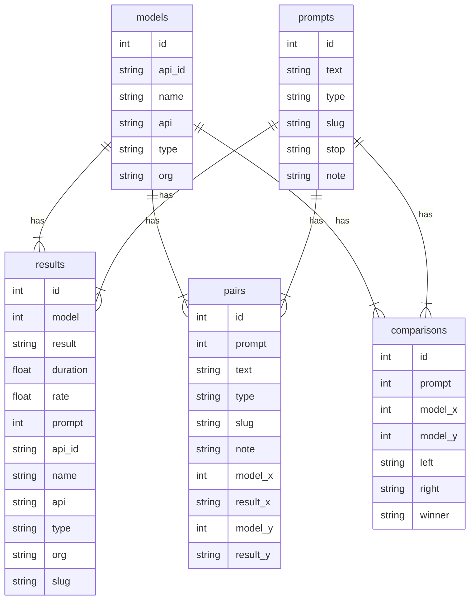

# Large Language Model Feedback Analysis and Optimization (LLMFAO)

This is a minimalistic [large language model](https://en.wikipedia.org/wiki/Large_language_model) (LLM) leaderboard that is based on human and machine feedback on pairwise responses of the models based on a carefully-selected set of prompts and different models.

- Overview: <https://evalovernite.substack.com/p/llmfao-human-ranking>
- Leaderboard: <https://dustalov.github.io/llmfao/>

## Data

The original [Crowdsourced LLM Benchmark](https://benchmarks.llmonitor.com/) dataset in files `prompts.jsonl`, `models.jsonl`, and `results.jsonl` was kindly provided by the team at [llmonitor.com](https://llmonitor.com/) under a [CC&nbsp;BY 4.0] license.

All files with substring `crowd` in the name have only prompts from a smaller subset non-coding and non-redundant prompts: `k8s`, `qft`, `vendor-extract`, `munchhausen`, `basic-sentiment`, `cot-apple`, `taiwan`, `sally`, `holidays`, `bagel`, `planets-json`, `blue`, `product-description` (13 out of 19 prompts).

All other data files were released under the same [CC&nbsp;BY 4.0] license by [Dmitry Ustalov](https://github.com/dustalov):

- `pairs.jsonl`, `pairs-crowd.jsonl`: sampled pairs
- `pairs-crowd-training.jsonl`: pairs for training the annotators
- `crowd-instruction.md`, `gpt-instruction.txt`: instructions for annotators and models
- `gpt3.jsonl`, `gpt4.jsonl`: GPT-3 and GPT-4 API requests
- `gpt*-responses.jsonl`: GPT-3 and GPT-4 API responses
- `*-comparisons.csv`: pairwise comparisons



## Code

All the code is released under the [GPLv3+] license, but if you use only the data and not the code, it does not apply to you.

```shell
pipenv run llmfao pairs  # generates pairs.jsonl and pairs-crowd.jsonl
pipenv run llmfao gpt3-requests  # generates gpt3.jsonl (makes no API requests)
pipenv run llmfao gpt4-requests  # generates gpt4.jsonl (makes no API requests)
```

The generated `gpt3.jsonl` and `gpt4.jsonl` files can be used to make requests to the OpenAI API via [api_request_parallel_processor.py](https://github.com/openai/openai-cookbook/blob/main/examples/api_request_parallel_processor.py) (not included here).

```shell
# GPT-3.5 Turbo Instruct
python3 api_request_parallel_processor.py \
    --requests_filepath 'gpt3.jsonl' \
    --save_filepath 'gpt3-responses.jsonl' \
    --request_url 'https://api.openai.com/v1/completions' \
    --max_requests_per_minute 3000 \
    --max_tokens_per_minute 80000
```
```shell
# GPT-4
python3 api_request_parallel_processor.py \
    --requests_filepath 'gpt4.jsonl' \
    --save_filepath 'gpt4-responses.jsonl' \
    --request_url 'https://api.openai.com/v1/chat/completions' \
    --max_requests_per_minute 150 \
    --max_tokens_per_minute 9000
```

After obtaining the responses from GPT models, it is possible to transform them into comparisons.

```shell
./transform.py gpt3-comparisons  # generates gpt3-comparisons.csv (makes no API requests)
./transform.py gpt4-comparisons  # generates gpt4-comparisons.csv (makes no API requests)
./transform.py gpt3-comparisons \
    --pairs pairs-crowd.jsonl \
    --output gpt3-crowd-comparisons.csv  # generates gpt3-crowd-comparisons.csv (makes no API requests)
./transform.py gpt4-comparisons \
    --pairs pairs-crowd.jsonl \
    --output gpt4-crowd-comparisons.csv  # generates gpt4-crowd-comparisons.csv (makes no API requests)
```

[CC&nbsp;BY 4.0]: LICENSE.CC-BY
[GPLv3+]: LICENSE.GPL
